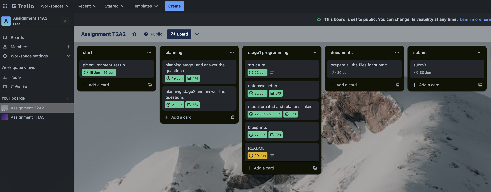

# ZhongjianXu_T2A2 - Mates API Web Application

[**GitHub Repository Link**](https://github.com/xzj66778899/Mates_API)  
***


## Installation and Setup<br>
Set up database and JWT secret key:
1. install PostgreSQL in your computer
2. create  database named 'Mates'
3. write the database url into .env file
4. write your JWT_SECRET_KEY into .env file

Run the commands:
```Python
# Create virtual environment
python3 -m venv .venv
source .venv/bin/activate

# Install pip packages
pip3 install -r src/requirements.txt

# Insert data into database
flask db create
flask db seed

# Run the application
flask run
```
***
## Table of Contents

- [R1](#r1)
- [R2](#r2)
- [R3](#r3)
- [R4](#r4)
- [R5](#r5)
- [R6](#r6)
- [R7](#r7)
- [R8](#r8)
- [R9](#r9)
- [R10](#r10)
***
## __R1__ 
<a name="r1"></a>
This API allows people to query the information about personal hobbies from the database by choosing different categories. 

## __R2__ 
<a name="r2"></a>
By using this API with our database, people can find those who share same hobbies with them, which can be further used to build online interest group, or combined with location services to gather offline avtivities.

## __R3__ 
<a name="r3"></a>
PostgreSQL database was used to structure the data and inentify the relationship among them. As the API functions mainly show the hobbies users share with, so a relational database is suitable for that purpose because the entities are interconnected, and by normalizing the data the database can help to ensure data consistency, thus finding and sorting the data is the advantage of the relational database.
But at the same time, it slows down the performance of the database comparing to non-relational ones.

## __R4__ 
<a name="r4"></a>
Object-Relational Mapping (ORM) acts as a bridge between relational database and object-oriented programming language.
By using SQLAlchemy in this case, we write python rather than SQL language to interact with the database, which makes data more readable and maintainable. 
The ORM also eliminates the SQL injection by the attackers because we no longer directly write SQL statements.

## __R5__ 
<a name="r5"></a>
Click and view [API End Points](docs/end_points.md)

## __R6__ 
<a name="r6"></a>
Click and view [ERD](docs/ERD.png)

## __R7__ 
<a name="r7"></a>
Flask is a lightweight framework that provides lots of third party service packages to implement the functions we want into the application. The following services are installed in this APP to expand the functionality.
### SQLAlchemy: ###
SQLAlchemy is a ORM tool that performs as a higher-level way to interact with database rather than plain database language. For example, It use Python Class with fields to define a database table and its columns. 

### Marshmallow: ###
It's a Python library that convert data types into Python data types. We created Schema class for the models then make Schema as a intermediator for getting and returning data.
For example, the following codes show how to convert a JSON data into Python object.
```
hobby_info = HobbySchema().load(request.json)
```

### Flask-Bcrypt: ###
It's a Flask extension that for hashing passwords in the database, which can protect the original plain text password even the database is hacked into. Because the hashing is a one-way road, it's not practical to decode a hashing password.
Also, it provides a function to check if the plain text password match the hashing password.

### Flask-JWT-Extended:  ###
It's a Flask extension that support JSON web tokens that commenly used for authentication in web applications. It can generate, vertificate and refresh tokens for users, as well as tracking the current user in the application.


## __R8__ 
<a name="r8"></a>
__Model user__: <br>
This model represents the table users in the database, which has a primary key 'id', columns are 'first_name', 'last_name', 'password', 'email', 'is_admin',and a foreign key 'gender_id'. This model also links to 'users_have_hobbies' so we set a db.relationship on it.

The 'email' works as an unique element to identify a user, so it set to be 'unique = True'.<br>

The 'is_admin' is set to 'default = False' which means that the user is normally registered as non-admin. This function needs to be improved later to prevent users from registering as an admin without authorization.

```PYTHON
class User(db.Model):
    __tablename__ = 'users'

    id = db.Column(db.Integer, primary_key=True)

    first_name = db.Column(db.String)
    last_name = db.Column(db.String)
    password = db.Column(db.String, nullable = False)
    email = db.Column(db.String, nullable = False, unique = True)
    is_admin = db.Column(db.Boolean, default=False)

    gender_id = db.Column(db.Integer, db.ForeignKey('genders.id'))
    gender = db.relationship('Gender', back_populates = 'users') 

    users_have_hobbies = db.relationship('User_has_hobby')


class UserSchema(ma.Schema):
    gender = fields.Nested('GenderSchema', exclude = ['id'])
    password = fields.String(required=True, validate=Regexp(
    r'^(?=.*[a-z])(?=.*[A-Z])(?=.*\d)(?=.*[@$!%*?&])[A-Za-z\d@$!%*?&]{8,}$',error='Password should contain at least one uppercase letter, one lowercase letter, one digit, one special character and be at least 8 characters long'))

    class Meta:
        fields = ("id",'first_name', 'password', 'last_name','email','gender','gender_id')
```

__Model gender__: <br>
This model represents table 'genders' in the database that has a primary key 'id' and column 'name'. It has been set relationship to 'users' model.

The 'name' column must be unique to prevent duplicated rows.

```PYTHON
class Gender(db.Model):
    __tablename__ = 'genders'

    id = db.Column(db.Integer, primary_key=True)

    name = db.Column(db.String, nullable = False, unique=True)
   

    users = db.relationship('User', back_populates = 'gender')


class GenderSchema(ma.Schema):
    class Meta:
        fields = ('id','name')
```

__Model hobby__: <br>
This model represents table 'hobbies' in the database that has a primary key 'id' and 'name' column. This model also links to 'users_have_hobbies'. If a 'hobby' is deleted, the associated 'user_has_hobby' will also be deleted, so it is set to "cascade = 'all,delete.

The 'name' column must be unique to prevent duplicated rows.


```PYTHON
class Hobby(db.Model):
    __tablename__ = 'hobbies'

    id = db.Column(db.Integer, primary_key=True)

    name = db.Column(db.String, nullable=False, unique=True)
   
    users_have_hobbies = db.relationship('User_has_hobby',cascade="all,delete")

class HobbySchema(ma.Schema):
    class Meta:
        fields = ('id','name',)
```

__Model user_has_hobby__: <br>
This model represents table 'users_have_hobbies' in the database that has a primary key 'id' and two foreign keys 'user_id' and 'hobby_id'.

```PYTHON
class User_has_hobby(db.Model):
    __tablename__ = 'users_have_hobbies'

    id = db.Column(db.Integer, primary_key=True)
   
    user_id = db.Column(db.Integer, db.ForeignKey('users.id'), nullable=False)
    users = db.relationship('User', back_populates = 'users_have_hobbies')

    hobby_id = db.Column(db.Integer, db.ForeignKey('hobbies.id',ondelete='CASCADE'), nullable=False)
    hobbies = db.relationship('Hobby', back_populates = 'users_have_hobbies')


class User_has_hobbySchema(ma.Schema):
    users = fields.Nested('UserSchema', exclude = ['password','email','gender','gender_id'])
    hobbies = fields.Nested('HobbySchema',exclude = ['id'])

    class Meta:
        fields = ('id','hobby_id','users','hobbies')
```


## __R9__ 
<a name="r9"></a>
The __'user'__ model contains users information and is the child object of __'gender'__, because one user only has one gender while one gender can belong to multipul users, which has a 'one to many' relationship between them. <br>

The __'user'__ model also has a relationship with __'hobby'__ model that one user can have many hobbies and one hobby can belong to multipul users. <br>
This 'many to many' relationship is bridged by the __'user_has_hobby'__ connecting model which only contains the primary keys of both parties and stores the relations between them. If one of the party is deleted, the connecting object will also be deleted by cascad deleting.

## __R10__ 
<a name="r10"></a>
For this project, I devided it into three parts:'planning, coding and documentation'.
The planning process includes:<br>
1. User stories: What is the scope of this project.<br>
   Tools: Word
2. ERD drawing: What are the entities and relationships of this project.<br>
        Tools: Lucid Drawing to draw the ERD
        
3. Documentation : Complete the rest of the REQUIREMENTS.<br>
        Tools: README.md

For the project management tool, Trello is used to manage the process. 
[click here for Trello](https://trello.com/invite/b/Cc3QyvmU/ATTIe97faff0535786514465d41b90046bff49B86687/assignment-t2a2)<br>

The scope was defined at the beginning of the project. Later in the middle of the project I decided to add more features on it, which formed an Agile method. As the main features still function, the added features can be worked independently. For example, if there are two developers, one works on the main features to ensure project deliverable and the other can work on a seperate branch.